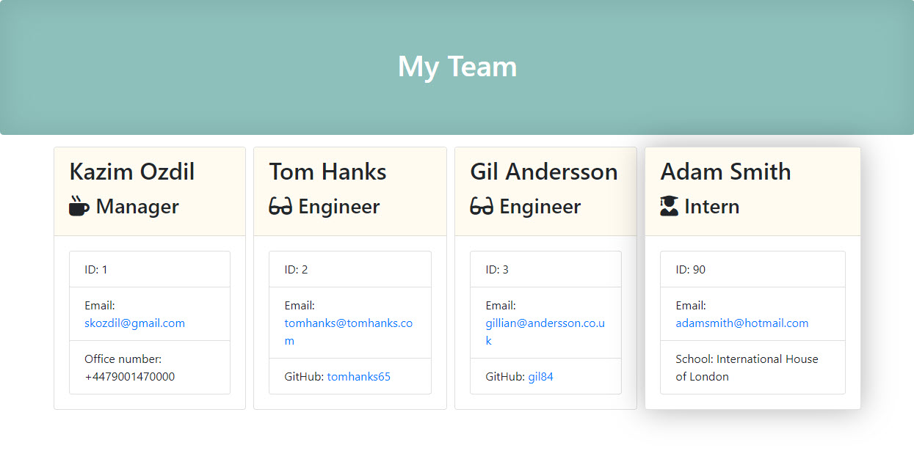

# Team Profile Generator
Team Profile Generator by using Inquirer and Node : This is a team profile generator by prompting questions. You can create 3 types of team members as Manager, Engineer and Intern. those are covered by Employee group.  

You can find the output file at [THIS LINK](https://ozdilkazim.github.io/Team-Profile-Generator/output/team.html)

This is a screenhot of output HTML page.

## Table of Contents
* [Installation](#installation)
* [Usage](#usage)
* [License](#license)
* [Contributing](#contributing)
* [Tests](#tests)
* [Questions](#questions)

## Installation
You should run `node -install` before running the code. 
## Usage
Follow installation guide while using `node index.js` for generate a team profile HTML page. 

## License
MIT License## Contributing
Thanks to Jung for incredible teaching.
## Tests
Use `npm run test` if you desire to make a test.
## Questions
If you have further questions, please click on my [Github Profile](https://www.github.com/ozdilkazim) or contact me at [skozdil@gmail.com](mailto:skozdil@gmail.com)